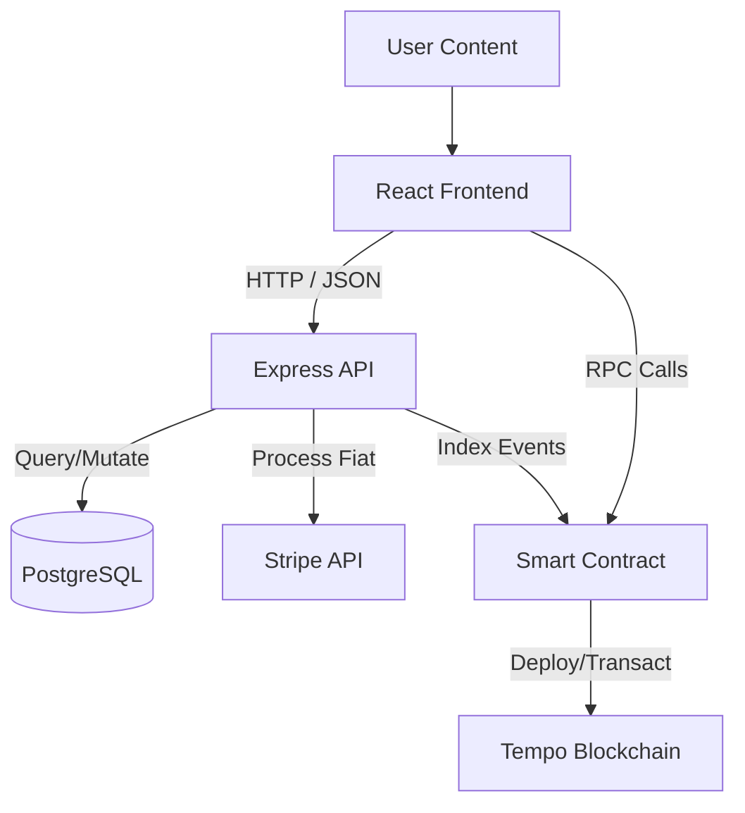

# System Architecture

## Overview
The Crypto Marketplace uses a **hybrid Web3 architecture**. It combines a traditional Web2 backend for performance, caching, and complex queries (PostgreSQL) with a Web3 layer for trustless asset ownership and transfer (Tempo Blockchain).

## 🏗️ Technology Stack

### Frontend (`my-crypto-marketplace`)
- **Framework**: React 18 (CRA)
- **Languages**: TypeScript, CSS, Tailwind CSS
- **Component Library**: Material UI (MUI) + Custom Tailwind utilities
- **State Management**: React Context (WalletContext)
- **Web3 Interaction**: `ethers.js` v6
- **Styling**: "Premium Midnight Blue" Dark Theme (Synced Custom Variables)

### Backend (`marketplace-server`)
- **Runtime**: Node.js (Express)
- **Database**: PostgreSQL
- **ORM**: Prisma
- **Payments**: Stripe API (Fiat), Dedicated Crypto Wallets
- **Features**: 
  - JWT Authentication (for Seller routes)
  - Image Uploads (Multer)
  - Marketplace Indexing (Syncing on-chain events)

### Blockchain (`marketplace-contracts`)
- **Network**: Tempo Testnet (Chain ID 42429)
- **Framework**: Hardhat
- **Contracts**: Solidity 0.8.24
- **Standards**: ERC-721 styling for unique assets

## 🧩 System Diagram

## 🔄 Key Workflows

### 1. Product creation (Minting)
1. User fills form on Frontend.
2. Image uploaded to Backend -> returns URL.
3. Metadata constructed.
4. User signs transaction to `createProduct` on Smart Contract.
5. Contract emits `ProductCreated` event.
6. Backend (or Indexer) detects event/API call and saves product to SQL DB for fast searching.

### 2. Purchasing
- **Crypto**: Direct call to `purchaseProduct` on Smart Contract with ETH/Stablecoin value.
- **Fiat**: Stripe Checkout session created -> Webhook triggers backend to execute "purchase on behalf" via Admin Wallet.

## 📂 Directory Structure
- `marketplace-contracts/`: Solidity source & deployment scripts.
- `marketplace-server/`: API endpoints, Prisma schema, Controllers.
- `my-crypto-marketplace/`: React source, Context providers, Pages.
